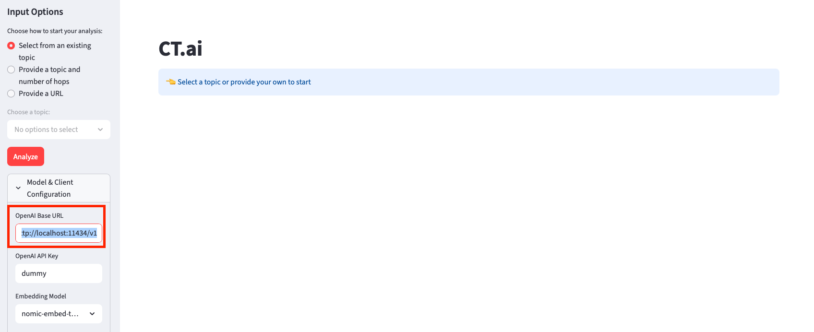

# Claim Graph
## Introduction
Claim Graph is an open-source tool for fact analysis and checking. It helps users form educated opinions by providing a comprehensive view of claims made by various people and organizations. Claim Graph automatically scrapes the web for articles, podcasts, videos, and other sources discussing a research topic or question. Users can also submit their own sources (e.g., article links) for claim analysis.

Polarizing issues—political, scientific, or otherwise—are often complex and nuanced. Logical conclusions require understanding diverse opinions, the biases behind them, and the arguments for and against each topic. Claim Graph aims to make this process easier by:
1. Showing the overall tone around a topic and how public sentiment changes over time
2. Summarizing the types of claims made about a topic, including:
    - Who made the claims
    - Who and how many support each claim
    - Who and how many oppose each claim

## Demo
Coming soon

## Requirements
* `python >= 3.11`
* `uv` for package management
* `ollama` is preferred for running LLMs locally. LLMs are used for multiple different tasks, including claim extraction from text

## High Level Design
Coming soon

## Getting Started
Install all the packages via `uv install` . `uv` automatically creates a virual environment and activates it for you. You can then run ` python -m streamlit run src/streamlit_app.py` to access the streamlit app.

### Supported Models
The Async OpenAI API is used to support running models either locally or in the cloud on the hardware of your choice. By default, the app is configured to point to a local ollama server at `http://localhost:11434/v1` with a dummy API key. This should only be used for development purposes, to iterate quickly.

You can change the server URL in the side bar of the Streamlit app:

## Contributing
See [CONTRIBUTING.md](CONTRIBUTING.md)
